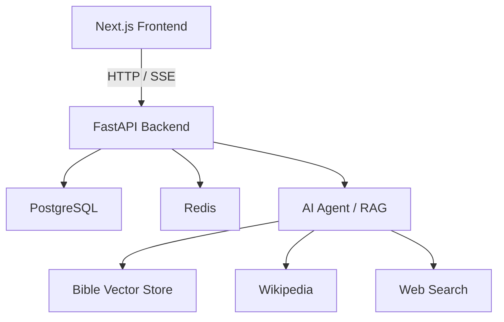

# VerseChat: Your Christian Assistant to Bible Knowledge

## Architectural Overview

**Frontend**: Next.js, React, Tailwind CSS, TypeScript\
 **Backend**: FastAPI, Python, LangChain \
 **LLM Provider**: GroqAPI \
 **Database**: PostgreSQL, SQLAlchemy\
 **Caching**: Redis

## Architecture Diagram



## Running the Application Locally

**Prerequisites**: Ensure you have Docker and Docker Compose installed on your machine.

1. Clone the repository:

   ```bash
   git clone https://github.com/amulyaprasanth/versechatv2.git
   ```

2. Change into the project directory:

   ```bash
   cd versechatv2
   ```

3. Run using Docker compose:

   ```bash
   docker-compose up --build
   ```

4. Access the application at `http://localhost:3000`.

## Acknowledgements

The Bible retrieval component of this project is based on
[Bible Vector Search](https://github.com/tim-hub/bible-vector-search)
by [tim-hub](https://github.com/tim-hub).

We are grateful to the author for making the project available under
the MIT License.
